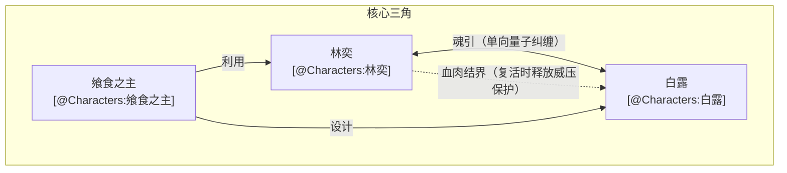
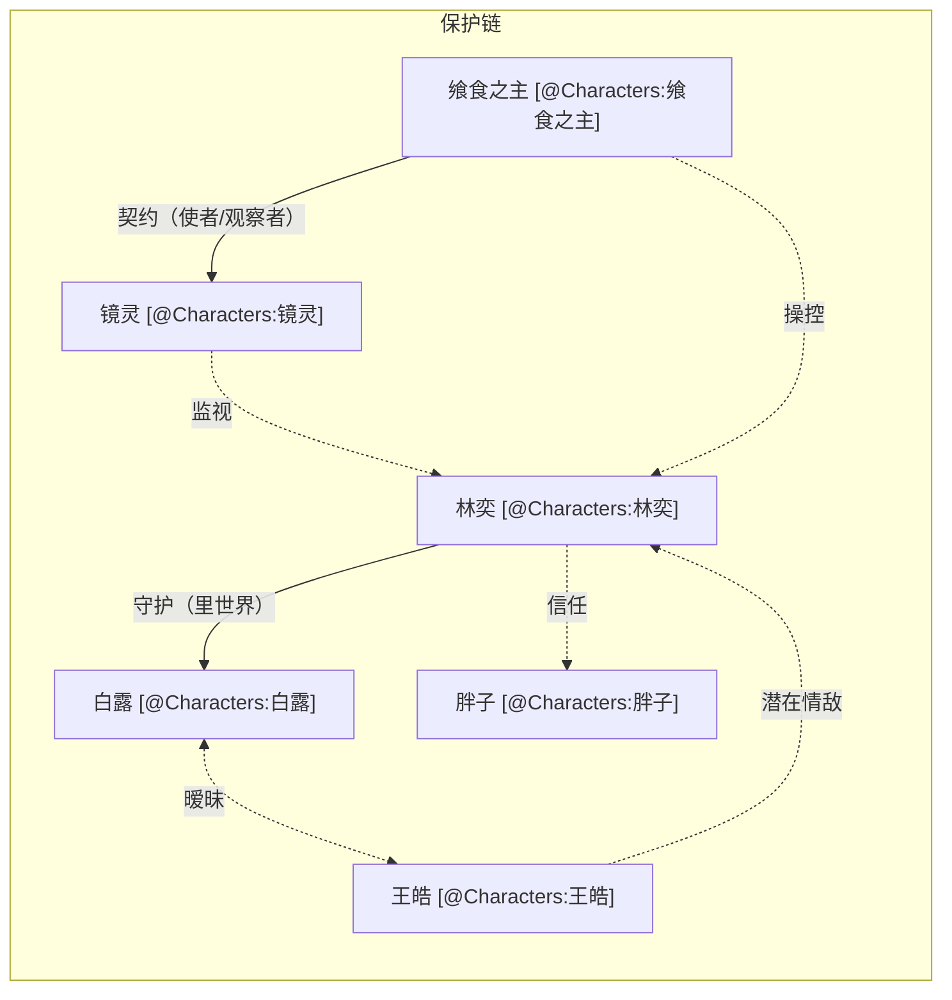
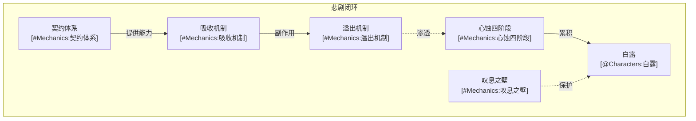
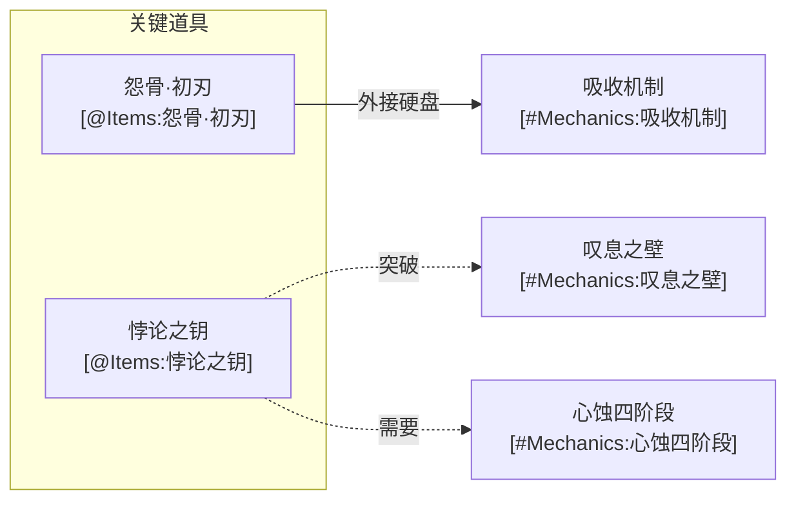

# 全局拓扑索引 (Global Index)

> 本文档是整个小说世界观的地图，采用 Mermaid 图展示核心实体和机制之间的关系。

## 核心三角关系



## 角色关系网络



## 核心机制关联图



## 物品与机制



## 完整世界关系图

```mermaid
flowchart TB
    %% 角色节点
    LY["林奕 [@Characters:林奕]"]
    BL["白露 [@Characters:白露]"]
    SZ["飨食之主 [@Characters:飨食之主]"]
    WHY["王皓 [@Characters:王皓]"]
    PZ["胖子 [@Characters:胖子]"]
    JG["镜灵 [@Characters:镜灵]"]

    %% 机制节点
    JM["契约体系<br/>[#Mechanics:契约体系]"]
    XS["吸收机制<br/>[#Mechanics:吸收机制]"]
    YC["溢出机制<br/>[#Mechanics:溢出机制]"]
    XE["心蚀四阶段<br/>[#Mechanics:心蚀四阶段]"]
    TX["叹息之壁<br/>[#Mechanics:叹息之壁]"]
    WG["无垢之光<br/>[#Mechanics:无垢之光]"]

    %% 物品节点
    YG["怨骨·初刃 [@Items:怨骨·初刃]"]
    BLZ["悖论之钥 [@Items:悖论之钥]"]

    %% === 角色间关系 ===
    LY <-->|"魂引"| BL
    SZ -->|"操控"| LY
    SZ -->|"设计"| BL
    LY -.->|"血肉结界（复活时释放威压保护）"| BL

    BL <-.->|"暧昧"| WHY
    WHY -.->|"潜在情敌"| LY
    LY -.->|"信任"| PZ

    SZ -->|"契约（使者/观察者）"| JG
    JG -.->|"监视"| LY

    %% === 悖论之钥关系链 ===
    BL -->|"心蚀积累到极限"| XE
    XE -.->|"第四阶段极暗"| BLZ
    BLZ -.->|"表层无垢内里极暗"| TX

    %% === 机制链条 ===
    JM -->|"赋予能力"| XS
    XS -->|"副作用"| YC
    YC -.->|"渗透"| XE
    XE -->|"累积"| BL

    %% === 无垢之光关系 ===
    WG -.->|"守护"| BL

    %% === 物品关联 ===
    YG -->|"分担负荷"| XS
