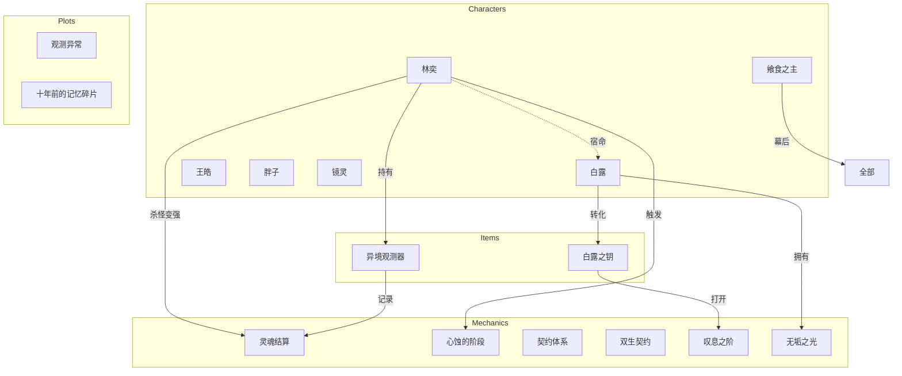

# 静态设定索引 (Static Index)

> 本文件自动生成，展示所有静态设定的关系拓扑

## 角色 (Characters) - 6

| 角色 | 核心关联 |
|------|---------|
| 林奕 | 主角，关联白露、异境观测器、灵魂结算 |
| 白露 | 女主角，关联林奕、白露之钥 |
| 王皓 | 暧昧对象 |
| 胖子 | 表世界唯一知情者 |
| 镜灵 | 冷漠/审视 |
| 飨食之主 | 幕后操控者 |

## 机制 (Mechanics) - 12

| 机制 | 约束 | 关联 |
|------|------|------|
| 心蚀的阶段 | 角色无法主动得知详细设定 | 林奕、白露 |
| 双生契约 | 宿命绑定 | 林奕、白露 |
| 灵魂之引 | 记忆传递 | 林奕 |
| 灵魂结算 | 杀怪变强的核心 | 林奕、异境观测器 |
| 契约体系 | 约束关系 | 林奕 |
| 战斗结算 | 战斗逻辑 | 战斗直觉 |
| 叹息之阶 | 顶级机制 | 白露之钥 |
| 无垢之光 | 白露核心 | 白露 |
| 死亡次数 | 限制/代价 | 林奕 |
| 记忆烙印 | 状态追踪 | 林奕 |
| 觉醒产物 | 升级产物 | 觉醒系统 |
| 观测异常 | 情报机制 | 观测异常 |

## 实体 (Entities) - 2

| 实体 | 描述 |
|------|------|
| 记忆图谱 | 林奕的记忆网络 |
| 记忆碎片 | 十年前的回忆 |

## 物品 (Items) - 7

| 物品 | 持有者 | 关联 |
|------|--------|------|
| 异境观测器 | 林奕 | 灵魂结算、契约体系 |
| 白露之钥 | 白露→林奕 | 叹息之阶、心蚀的阶段 |
| 战斗直觉 | 林奕 | 战斗结算 |
| 觉醒系统 | 林奕 | 灵魂结算 |
| 消耗品 | 林奕 | - |
| 材料 | 林奕、白露 | - |
| 货币 | - | 记忆碎片 |

## 剧情线 (Plots) - 4

| 剧情 | 描述 |
|------|------|
| 观测异常 | 30-50章 |
| 十年前的记忆碎片 | 回忆线 |
| 日常与战斗关系 | 日常线 |
| 心蚀碰撞 | 核心冲突 |

---

## Mermaid 关系图

---

## 数据统计

- **总计**: 31 个静态实体
- **Characters**: 6
- **Mechanics**: 12
- **Entities**: 2
- **Items**: 7
- **Plots**: 4

---

*最后更新: 2026-04-02*
