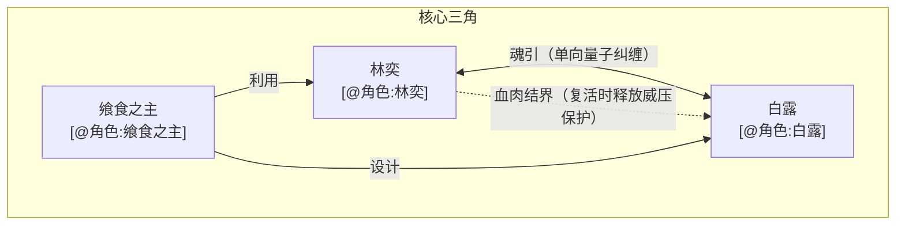
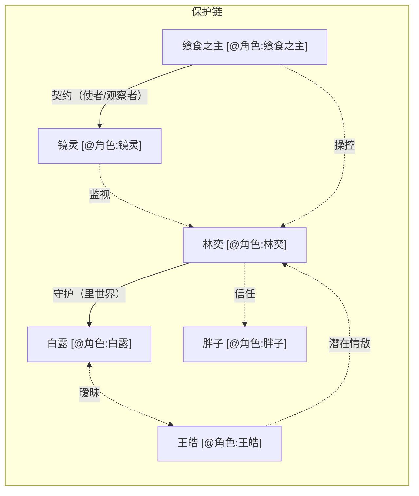
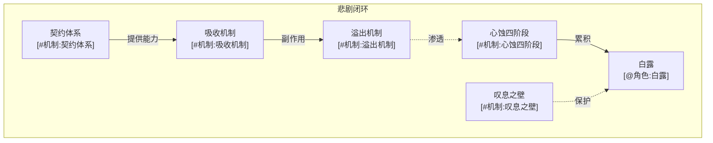
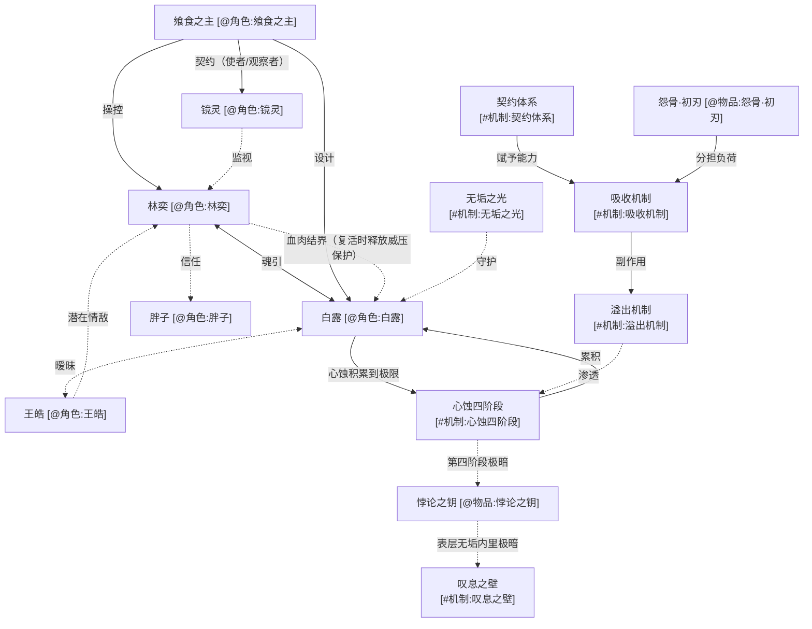

# 全景索引

> 本文档是整个小说世界观的地图，采用 Mermaid 图展示核心实体和机制之间的关系。

## 核心三角关系

## 角色关系网络

## 核心机制关联图

## 完整世界关系图

## 索引表

### 角色

| 角色 | 核心定位 | 关联机制 |
|------|---------|---------|
| [@角色:林奕] | 主角，空心人，窃命者 | [#机制:契约体系] [#机制:吸收机制] [#机制:溢出机制] |
| [@角色:白露] | 女主角，无垢之魂，终极工具 | [#机制:心蚀四阶段] [#机制:叹息之壁] [#机制:无垢之光] |
| [@角色:王皓] | 暧昧对象，表世界普通人 | - |
| [@角色:胖子] | 唯一朋友，前期知情者 | - |
| [@角色:镜灵] | 冷漠审视者 | [#机制:契约体系] |
| [@角色:飨食之主] | 幕后黑手，造局者 | [#机制:契约体系] |

### 底层机制

| 机制 | 绝对限制 |
|------|---------|
| [#机制:契约体系] | 复活需支付"买路钱"（未来与感官） |
| [#机制:吸收机制] | 杀戮吸收意志碎片，等级越高代价越大 |
| [#机制:溢出机制] | 单次超载10%触发，非线性比例 |
| [#机制:心蚀四阶段] | 单向不可逆进程 |
| [#机制:叹息之壁] | 秩序法则屏障，外部污染会被净化 |
| [#机制:无垢之光] | 白露的核心能力 |
| [#机制:双轨世界] | 表世界与里世界的分离与交互 |
| [#机制:死亡刻印法则] | 必须被斩杀才能学习攻击 |
| [#机制:战斗技能树] | 等价交换原则 |
| [#机制:逆化力场] | 表世界工业造物会被逆化 |

### 物品

| 物品 | 类型 |
|------|------|
| [@物品:怨骨·初刃] | 契约武器 |
| [@物品:悖论之钥] | 关键道具 |
| [@物品:背刺黑影] | 武器 |
| [@物品:泣血之牙] | 武器 |

### 剧情事件

| 剧情线 | 章节 |
|--------|------|
| [#剧情事件:初次察觉异常] | 第1章 |
| [#剧情事件:十年前闪回序章] | 序章 |
| [#剧情事件:日常与三角关系] | 日常线 |
| [#剧情事件:胖子撞破真相] | 待定 |

## 引用语法速查

- 角色：`[@角色:角色名]`
- 机制：`[#机制:机制名]`
- 物品：`[@物品:物品名]`
- 实体：`[@实体:实体名]`
- 剧情：`[#剧情事件:剧情名]`

> ⚠️ **重要**：每次新增实体或修改关联后，请同步更新本文档。
